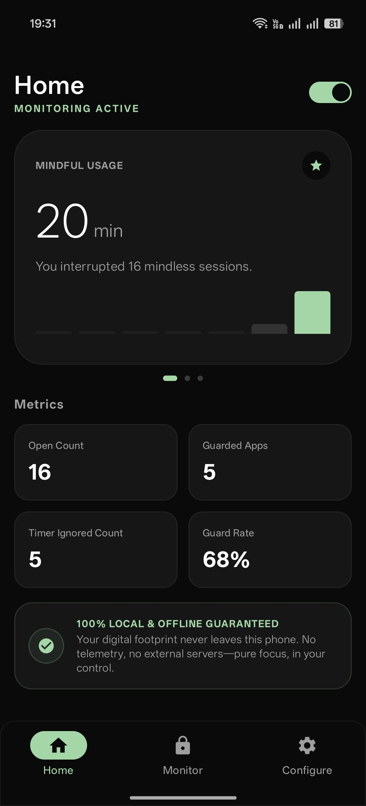
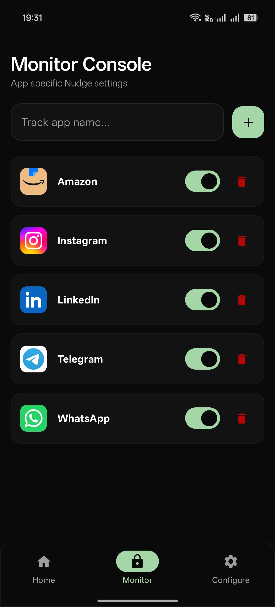
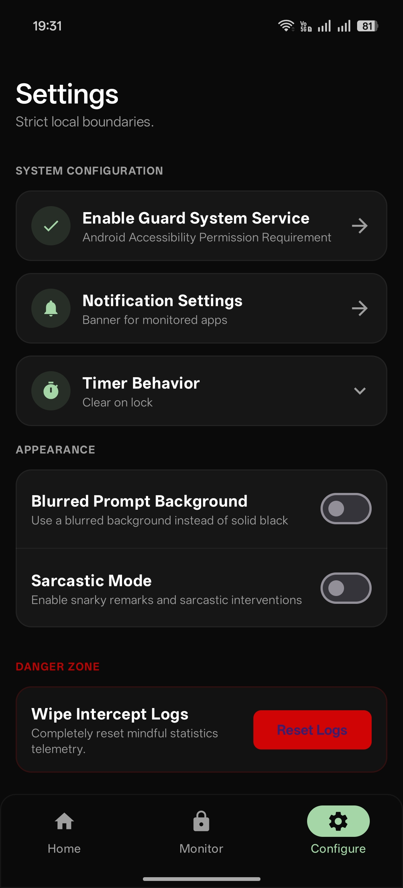
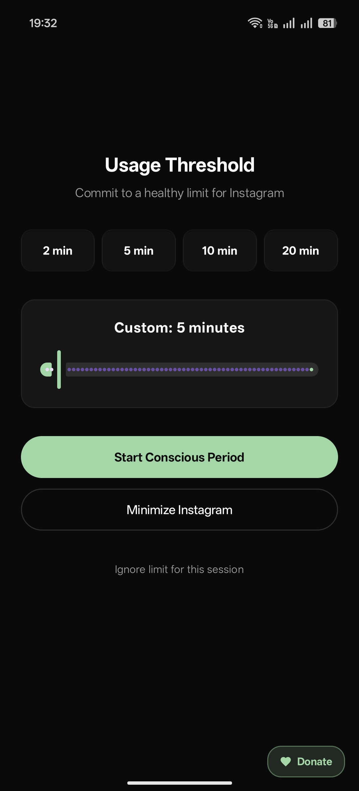

<div align="center">

# 🌱 Nudge!

### _Sometimes all we need is a Nudge._

**A lightweight, on‑device, _mindfully disruptive_ app that helps you break the doomscroll — before the app you opened on autopilot pulls you back in.**

100% local · 100% offline · zero telemetry.

<br/>


-2ea44f)


</div>

---

## ✨ What is Nudge?

We rarely _decide_ to lose an hour to a feed — we open an app on muscle memory and resurface much later wondering where the time went.

**Nudge!** sits quietly in the background and, the moment you open an app you've chosen to guard, it gently interrupts you with a **Mindful Prompt**: _how long do you actually want to spend here?_ You commit to a conscious window, and when the time is up, Nudge nudges again. That tiny pause is often all it takes to close the app and get on with your day.

No accounts. No cloud. No ads. Everything happens on your device.

---

## 📱 Screenshots

<div align="center">

| Home | Monitor Console | Configure | Mindful Prompt |
|:---:|:---:|:---:|:---:|
|  |  |  |  |
| Insights, live metrics & your offline guarantee | Pick exactly which apps to guard | Fine‑tune behavior, appearance & privacy | The conscious‑usage prompt on every open |

</div>

---

## 🧠 How it works

```
Open a guarded app  ─►  Mindful Prompt: "Commit to a healthy limit"
        │                        │
        │                 pick a duration
        ▼                        ▼
  Timer runs quietly  ──►  Time's up  ──►  Extend?  or  Close the app
```

1. **Choose your apps** — add any installed app (Instagram, WhatsApp, Amazon, …) to the Monitor Console.
2. **Get nudged** — opening a guarded app triggers a full‑screen prompt asking you to set a usage limit (quick pills or a custom slider).
3. **Stay aware** — the countdown runs in the background; a single, collapsible notification shows every running timer with a **Reset** button.
4. **Time's up** — when your window ends, Nudge asks whether to extend or wrap up. Ignore the limit for a session if you really must.
5. **Daily quotas** _(optional)_ — expand any app in the Monitor Console to set a per‑day budget. Once it's spent, the next open shows a red **Daily Limit Reached** gate before any timer; with **Strict Mode** on, the app stays locked for the day.

---

## 🚀 Features

- 🛡️ **Per‑app guarding** — protect only the apps that pull you in.
- ⏳ **Conscious usage windows** — quick 2/5/10/20‑min pills or a 1–60 min custom slider.
- � **Daily usage quotas** — give any app a per‑day budget, charged by *real* time spent in the app. Spend it and the next open shows a red "daily limit reached" gate before any timer.
- 🔒 **Strict Mode** — when a quota is spent, optionally *block* the app entirely until you disable Strict Mode or raise the quota.
- 🔁 **Independent multi‑app timers** — several apps can run their own countdowns at once.
- 🔔 **Live status notification** — one collapsible banner lists each active timer with a live countdown and a per‑app reset (fully optional, off by default).
- 🧭 **Timer Behavior modes** — decide what happens to a running timer (see below).
- 😏 **Sarcastic Mode** — swap gentle encouragement for savage, escalating snark.
- 🌫️ **Blurred prompt background** — an optional frosted look for the intervention screen.
- 📊 **Day‑wise insights** — a swipeable dashboard: pick any of the last 7 days to see total usage, per‑app breakdowns, and your intervention behavior (completed vs. early‑closed vs. bypassed).
- ❤️ **Support the developer** — an optional in‑app tip jar (UPI & Ko‑fi).
- 🔕 **Runs on device** — powered by Android's Accessibility Service + a lightweight foreground service that keeps your timers alive.

---

## ⏱️ Timer Behavior modes

Configure how a running timer should behave under **Configure → Timer Behavior**:

| Mode | Behavior |
|---|---|
| **Clear on lock** _(default)_ | Timers keep running while you use the phone, but **reset when you lock the screen** — so every fresh session asks again. |
| **Persistent** | A timer runs until it expires **no matter what** — minimizing, switching apps, or removing it from recents won't stop it. |

---

## 📅 Daily quotas & Strict Mode

Give any monitored app a **daily quota** — open the **Monitor Console** and tap an app to expand it, then set a budget with the slider or the quick presets.

- **Charged by actual usage** — quota is spent by real foreground time, not by the timer you pick. Set a 30‑min timer but leave after 5, and only 5 minutes come off your budget.
- **Always visible** — the Mindful Prompt shows how much of today's quota is left, right above the time options.
- **Soft gate** — once the quota is spent, opening the app shows a red **Daily Limit Reached** screen *before* any timer. Choose **Continue Anyway** to still set a timer, or close the app.
- **Strict Mode** _(Configure → System)_ — turn an exhausted quota into a hard **block**: the app stays locked for the day, and the only way in is to disable Strict Mode or raise the quota. A voluntary hard stop for the days you need it.

Budgets reset automatically at local midnight.

---

## 😏 Sarcastic Mode

Prefer tough love? Flip on **Sarcastic Mode** for snarky interventions that escalate the more you push your luck — longer durations and repeated extensions unlock progressively harsher remarks. It's brutal, and it works.

> _"Just five more minutes, right? We've all heard that before."_

---

## 🔒 Privacy first

Nudge is built to be trustworthy by design:

- **100% on‑device** — usage data, timers and logs never leave your phone.
- **No servers, no telemetry, no analytics, no ads.**
- **Works fully offline.**
- Uses the Accessibility Service **only** to detect which app is in the foreground — it does not read, store, or transmit screen content.

---

## 🛠️ Tech stack

- **Language:** Kotlin
- **UI:** Jetpack Compose + Material 3 (custom mint‑on‑black theme)
- **Architecture:** MVVM, `StateFlow`, Kotlin Coroutines
- **Persistence:** Room (session history) + SharedPreferences (settings & live timers)
- **Foreground detection:** Android `AccessibilityService`
- **Reliability:** a foreground `Service` keeps the process (and your timers) alive
- **Store:** Google Play In‑App Review API

---

## 🏗️ Build & run

**Prerequisites:** [Android Studio](https://developer.android.com/studio) (latest), JDK 17+, and a device/emulator running **Android 10 (API 29)** or newer.

```bash
git clone https://github.com/hichauhan/nudge.git
cd nudge
```

1. Open the project in **Android Studio** and let it sync Gradle.
2. _(Optional)_ Copy `.env.example` to `.env`. The app is fully offline and needs **no API key** at runtime; the file just satisfies the Gradle secrets plugin.
3. Run on an emulator or a physical device.
4. On first launch, follow the onboarding and **grant the Accessibility permission** (Configure → _Enable Guard System Service_) so Nudge can detect app launches.

> ℹ️ The intervention prompt only appears for apps you've added in the **Monitor Console**.

---

## 🔐 Permissions

| Permission | Why it's needed |
|---|---|
| **Accessibility Service** | Detects which app comes to the foreground so it can prompt you. Never reads or transmits screen content. |
| **Foreground Service** _(special use)_ | Keeps timers running reliably in the background. |
| **Post Notifications** | Shows the optional live‑timer banner (off by default). |
| **Query All Packages** | Lists your installed apps so you can choose which to guard. |

---

## 🗺️ Roadmap ideas

- Per‑app schedules (e.g. quotas that apply only on weekdays)
- Weekly mindful‑usage summary
- Home‑screen widget refinements
- Localization

---

## 📄 License

Distributed under the **MIT License**. See `LICENSE` for more information.

<div align="center">

<br/>

**Built with focus, for focus.** ☕

_If Nudge helps you reclaim a little time, consider leaving a ⭐ on the repo._

</div>
