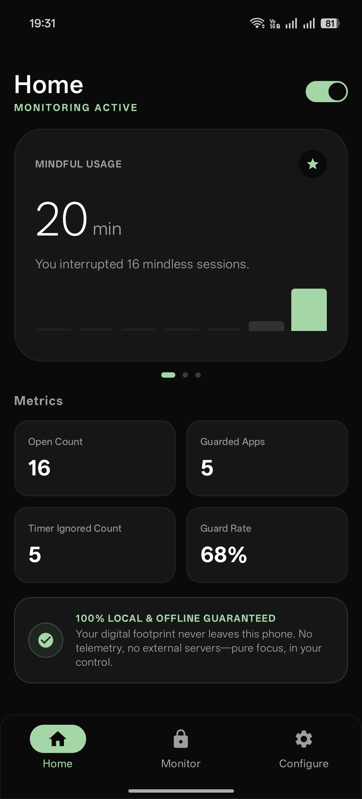
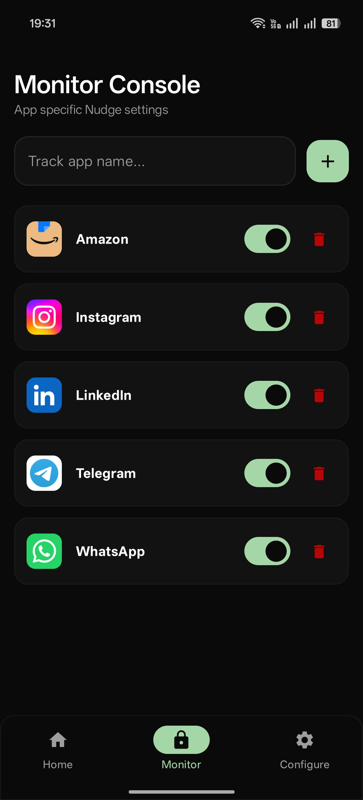
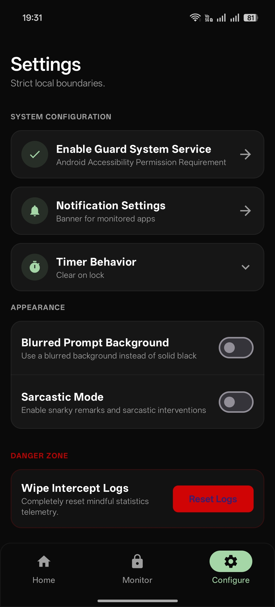
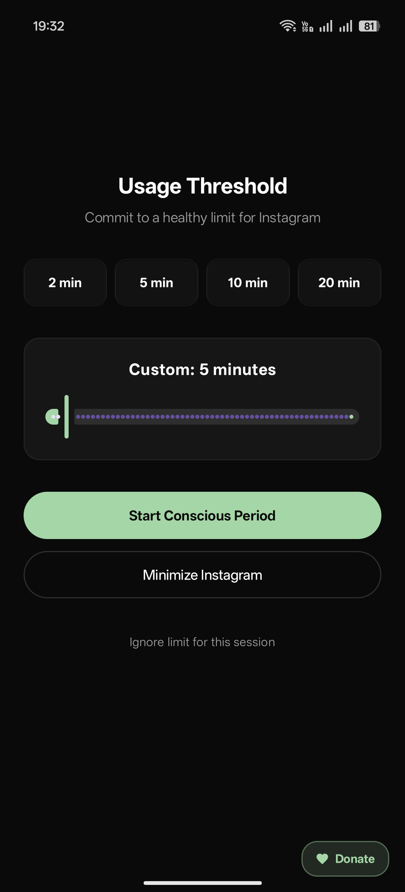

<div align="center">

# 🌱 Nudge!

### _Sometimes all we need is a Nudge._

**A lightweight, on‑device, _mindfully disruptive_ app that helps you break the doomscroll — before the app you opened on autopilot pulls you back in.**

Local usage history · offline monitoring · no telemetry uploaded.

<br/>


-2ea44f)


</div>

---

## ✨ What is Nudge?

We rarely _decide_ to lose an hour to a feed — we open an app on muscle memory and resurface much later wondering where the time went.

**Nudge!** sits quietly in the background and, the moment you open an app you've chosen to guard, it gently interrupts you with a **Mindful Prompt**: _how long do you actually want to spend here?_ You commit to a conscious window, and when the time is up, Nudge nudges again. That tiny pause is often all it takes to close the app and get on with your day.

No accounts. No cloud. No ads. Everything happens on your device.

## Version 6.0.0

- Accessibility disclosure version 2 uses **Agree and enable** and **Decline**. Previous disclosure acceptance is not reused. Back, Home, scrolling, and inactivity never grant consent. The obsolete one-button permission screen has been removed.
- Monitoring status is in **Configure > Guard System Service**, not on Home. It distinguishes Android permission from the service connection and includes notifications, prompt preview, pause, resume, and confirmed disable. Users with valid consent manage their existing access without seeing Agree/Decline again; first-time access and re-enabling after withdrawal still require the disclosure. Timed pauses (15/30/60 minutes) and an optional Quick Settings tile are available. Android may defer the inexact resume alarm; the next foreground event also checks its deadline. Revoking consent or manually pausing cancels automatic resume.
- Configure includes reusable Work, Evening, and Bedtime profiles, editable weekdays and time windows, shared app budgets, and a weekly tracked-time goal. Assign a profile per app in Monitor; outside its schedule, that app is not guarded or charged. Overnight windows belong to their starting weekday. Shared budgets add the recorded usage of their members; the tighter individual/shared limit applies.
- Per-app settings include a preferred/remembered duration, prompt tone, maximum extensions, and optional cooldown after the final extension. These remain voluntary rules: pause, settings, and uninstall remain available.
- Home includes recent 7/28-day trends and recorded-day counts. Date-window queries load recent history and the selected historical week; older records are not deleted. The widget reads only today's aggregate and refreshes are coalesced.
- Configure offers the original dark theme, an optional light/system theme, and English/Hindi core controls. Hindi includes the complete accessibility disclosure and key actions; detailed explanations and sarcastic remarks still fall back to English.
- New Configure entries use the existing outlined icon/title/subtitle blocks. Schedules, shared budgets, Theme, and Language open popup dialogs; Privacy & Recovery uses matching blocks. Home trends use the same framed style as the weekly summary. The intervention coffee button reveals only Ko-fi and UPI to its left, with matching button/icon sizes.
- Privacy & Recovery offers CSV export and authenticated, passphrase-encrypted backup/restore through Android's document picker. CSV is readable plaintext. Backups use AES-256-GCM with PBKDF2-HMAC-SHA256 (600,000 iterations), random salt/nonce, and a 32 MB plaintext limit. Consent, active timers, and cooldowns are never restored. Exports may be uploaded by the storage provider the user chooses; they are not deleted when Nudge is uninstalled.
- Dashboard rendering and view-model state now live separately from the main navigation screen. New controls, rule logic, and data transfer have their own modules.

See [PLAY_STORE_SUBMISSION.md](PLAY_STORE_SUBMISSION.md) before publishing this release. Automated checks do not substitute for testing the signed Play-delivered build on real devices.

---

## 📱 Screenshots

<div align="center">

| Home | Monitor Console | Configure | Mindful Prompt |
|:---:|:---:|:---:|:---:|
|  |  |  |  |
| Insights, live metrics & your offline guarantee | Pick exactly which apps to guard | Fine‑tune behavior, appearance & privacy | The conscious‑usage prompt on every open |

</div>

---

## 🧠 How it works

```
Open a guarded app  ─►  Mindful Prompt: "Commit to a healthy limit"
        │                        │
        │                 pick a duration
        ▼                        ▼
  Timer runs quietly  ──►  Time's up  ──►  Extend?  or  Close the app
```

1. **Review accessibility access** — read the dedicated in-app disclosure. Choose **Agree and enable** to open Android settings, or **Decline** to continue without automatic monitoring. Android approval is a separate step.
2. **Choose your apps** — add launchable apps to the Monitor Console. Android Settings, package installers, home launchers, and Nudge itself are excluded so device controls remain accessible.
3. **Get nudged** — opening a guarded app prompts for a timer or a deliberate choice to close or continue without one.
4. **Stay aware** — independent countdowns continue while you switch apps. Android can show a grouped notification with a reset action for each timer.
5. **Time's up** — extend, close the app, or continue without a timer. Sarcastic mode adds a two-choice confirmation before ignoring a limit.
6. **Daily quotas** _(optional)_ — set a foreground-time budget per app. Nudge checks it while the app is active and on its next foreground event; Strict Mode blocks continued use after the budget is spent.

---

## 🚀 Features

- 🛡️ **Per‑app guarding** — protect only the apps that pull you in.
- ⏳ **Conscious usage windows** — quick 2/5/10/20‑min pills or a 1–60 min custom slider.
- � **Daily usage quotas** — give any app a per‑day budget, charged by *real* time spent in the app. Spend it and the next open shows a red "daily limit reached" gate before any timer.
- 🔒 **Strict Mode** — when a quota is spent, optionally *block* the app entirely until you disable Strict Mode or raise the quota.
- 🔁 **Independent multi‑app timers** — several apps can run their own countdowns at once.
- 🔔 **Live status notification** — grouped timer notifications with countdowns and reset actions. Notification visibility is controlled by Android; denying notification access does not grant or withdraw accessibility consent.
- 🧭 **Timer Behavior modes** — decide what happens to a running timer (see below).
- 😏 **Sarcastic Mode** — optional, app-aware wit with four extension tiers, compact action labels, and randomized ignore-limit remarks. Consent, privacy, and recovery controls stay neutral.
- 🌫️ **Blurred prompt background** — an optional frosted look for the intervention screen.
- 📊 **Day-wise insights** — one labeled, accessible seven-day selector below the carousel drives all three cards and the intercept log. The third card shows explicit Resisted / Extended / Bypassed choices and a stop rate.
- 📅 **Selectable weekly summary** — tap the calendar icon and choose the last day of a seven-day period. The calendar highlights the whole period; future dates are disabled and older history stays available.
- 🧿 **Quota rings & polished prompts** — the intervention and Monitor screens show a thin circular used‑vs‑quota ring, backed by subtle motion, light haptics, and a soft scale‑in entrance.
- 🧩 **Home‑screen widget** — a compact, on‑brand widget (rounded, mint‑accented, monospace) showing your mindful stats at a glance.
- ☕ **Buy me a coffee** — optional UPI and Ko-fi support in Configure and the prompt/expiry screens. Tips unlock nothing and payment takes place in another app or browser. Playto remains unavailable.
- 🔕 **Runs on device** — event-driven foreground detection and a foreground service while timers run. Android or the device manufacturer may still delay or stop background work.

---

## ⏱️ Timer Behavior modes

Configure how a running timer should behave under **Configure → Timer Behavior**:

| Mode | Behavior |
|---|---|
| **Clear on lock** _(default)_ | Timers keep running while you use the phone, but **reset when you lock the screen** — so every fresh session asks again. |
| **Persistent** | Timers continue across app switches and screen locking, with deadlines restored after process recreation. Android force-stop, revoked access, or pausing monitoring can stop reminders. |

---

## 📅 Daily quotas & Strict Mode

Give any monitored app a **daily quota** — open the **Monitor Console** and tap an app to expand it, then set a budget with the slider or the quick presets.

- **Charged by actual usage** — quota is spent by real foreground time, not by the timer you pick. Set a 30‑min timer but leave after 5, and only 5 minutes come off your budget.
- **Always visible** — the Mindful Prompt shows how much of today's quota is left, right above the time options.
- **Soft gate** — once the quota is spent, opening the app shows a red **Daily Limit Reached** screen *before* any timer. Choose **Continue Anyway** to still set a timer, or close the app.
- **Strict Mode** _(Configure → System)_ — block a monitored app after its quota is exhausted. You can always disable Strict Mode, raise the quota, pause monitoring, revoke access, or uninstall. This is voluntary self-management, not tamper-proof parental control.

Budgets reset automatically at local midnight.

---

## 😏 Sarcastic Mode

Flip on **Sarcastic Mode** for sharper commentary on long sessions and repeated extensions. Remarks target the scrolling decision, not a person's worth or health. There are no promises of behavioral or medical outcomes, and you can turn the mode off at any time.

> _"Your quick check now has a director's cut."_

> _"The limit is now a historical document. Please handle it with care."_

## History and statistics

- The previous history query returned only the latest 100 records, which could make older days look empty. Version 5.1.0 removes that cap. Records still in the database become visible again; previously deleted data cannot be reconstructed.
- New usage entries measure foreground time for enabled monitored apps, including bypassed sessions. They are checkpointed every 30 seconds while active and flushed on app switches, prompts, pause, or screen-off. Calendar-day boundaries respect timezone and daylight-saving changes.
- Older versions logged timer-duration estimates, sometimes including time in the background. Those records remain unchanged. Historical totals can therefore mix older estimates and newer foreground measurements.
- **Resisted** means an explicit Close/Minimize/Back choice in a prompt. **Extended** is recorded when more time is requested, not after that timer finishes. **Bypassed** is an explicit ignore-limit choice. Automatic expiry and lock-screen cancellation do not count as resisted.
- **Stop rate** is `100 × Resisted / (Resisted + Extended + Bypassed)`. No decisions shows a dash, not an artificial 100%. It is a decision ratio, not a clinical assessment.
- **Best Day** is the day with most resisted choices, or the lowest recorded usage among days with records when no resisted choice exists. Ties favor the most recent day. Weekly minutes are rounded after adding the seconds.
- This is not a complete system screen-time service: no data can be captured before consent, while disabled, or after force-stop. A sudden process kill can lose the last unflushed interval. OEM event delivery and power management can affect accuracy and reminder timing.

---

## 🔒 Privacy first

Nudge is built to be trustworthy by design:

- **On-device by default** — no app-operated upload or telemetry. Only an explicit export writes history or an encrypted backup to a user-selected storage provider.
- **No servers, no telemetry, no analytics, no ads.**
- **No Internet permission** and no app-operated upload, analytics, advertising, or networking stack. Optional external links and Google Play reviews use their respective providers.
- **Monitoring works offline.** UPI, Ko-fi, developer-site links, and Google Play may use a network in their own apps; those providers' privacy policies apply.
- Accessibility consent is versioned and enforced before event processing, including for upgrades and services enabled outside the app. The service requests no window-content access, gestures, or interactive-window retrieval, and declares `isAccessibilityTool=false`.
- Local database and preferences are excluded from Android cloud backup and device transfer. Privacy text is available in **Configure → Privacy & Recovery** and in the published [privacy policy source](index.html).

## Pause, revoke, reset, uninstall

1. **Pause:** use the Home monitoring switch or **Configure → Privacy & Recovery → Pause, reset or uninstall**. Active timers stop; recorded history remains.
2. **Withdraw consent:** choose **Withdraw accessibility consent** in Configure. Monitoring stops, and the service disables itself. Re-enabling requires another affirmative choice in the disclosure and Android approval.
3. **Clear history:** **Configure → Clear Local History → Clear**, then confirm. This pauses monitoring and deletes recorded usage/decisions while keeping monitored-app settings and today's quota counters.
4. **Start fresh:** **Configure → Privacy & Recovery → Pause, reset or uninstall → Clear all local app data**, then confirm. Android clears app storage and closes Nudge. All local data and consent are removed.
5. **Android recovery:** Settings → Accessibility → Installed apps → Nudge → Off. Then Settings → Apps → Nudge → Force stop, Storage → Clear storage, or Uninstall. Labels vary by manufacturer. No PIN, administrator removal, special uninstall, or factory reset is needed.

Nudge does **not** prevent uninstall, lock Android Settings, or offer parental supervision. Adding those capabilities would be a separate product and policy decision, not an extension of this self-management release.

---

## 🛠️ Tech stack

- **Language:** Kotlin
- **UI:** Jetpack Compose + Material 3 (custom mint‑on‑black theme)
- **Architecture:** MVVM, `StateFlow`, Kotlin Coroutines
- **Persistence:** Room (session history) + SharedPreferences (settings & live timers)
- **Foreground detection:** Android `AccessibilityService`
- **Reliability:** persisted timer identity/deadlines, monotonic countdowns, idempotent history events, explicit Room migrations, and a foreground service while timers run
- **Store:** Google Play In‑App Review API

---

## 🏗️ Build & run

**Prerequisites:** JDK 17, Android SDK platform 36.1 / build tools 36.0.0, and a device/emulator running **Android 10 (API 29)** or newer. The checked-in wrapper pins Gradle 9.3.1 and verifies its distribution checksum for AGP 9.1.1.

```bash
git clone https://github.com/hichauhan/nudge.git
cd nudge
```

1. Open the project in **Android Studio** and let it sync Gradle.
2. No API keys or secrets file are required. Debug builds use Android's standard debug keystore.
3. Run on an emulator or a physical device.
4. On first launch, review the dedicated Accessibility disclosure. Test both **Decline** and **Agree and enable** before turning the service on in Android settings.

```powershell
.\gradlew.bat :app:testDebugUnitTest :app:lintDebug :app:assembleDebug
.\gradlew.bat :app:assembleRelease :app:lintRelease
```

Release builds enable R8 and resource shrinking. Without an upload keystore, the release APK and bundle are unsigned build-validation artifacts. For a Play upload, configure `KEYSTORE_PATH`, `STORE_PASSWORD`, and `KEY_PASSWORD` in your publishing environment (alias `upload`), then run `:app:bundleRelease`; do not commit or share those secrets. Version code is 7 and version name is 6.0.0; use a larger unused code if Play Console already has 7 or higher. Both supported language resources are packaged so manual language switching works offline.

On Windows, Kotlin/KSP can misinterpret `!` in a project path as a JAR separator. Build from a path such as `C:\Projects\nudge` without `!`, or run [scripts/verify.ps1](scripts/verify.ps1). The script accepts `-JavaHome` and `-SdkPath` (or their standard environment variables), runs all tests, debug/release APK and bundle builds, and lint. If the source path contains `!`, it uses a disposable source copy excluding signing material and collects results under `build/verification`. Native UI previews are generated with Roborazzi; standalone test runs can enable them with `-Proborazzi.test.record=true`.

Tests cover history beyond 100 records, non-destructive migrations, duplicate events, DST/midnight boundaries, explicit consent and refusal, timer restoration/pause, quota-setting updates, compact UI count visibility, and backup exclusions. Real-device tests are still required for OEM accessibility events, lock/unlock, process recovery, UPI handoff, and review flows.

> ℹ️ The intervention prompt only appears for apps you've added in the **Monitor Console**.

---

## 🔐 Permissions

| Permission | Why it's needed |
|---|---|
| **Accessibility Service** | With in-app consent and Android approval, reads foreground package-change events for reminders, usage history, and quotas. No screen-content access. Not an accessibility tool for disability support. |
| **Foreground Service** _(special use)_ | Keeps timers running reliably in the background. |
| **Post Notifications** | Allows Android to display active-timer notifications. Controlled separately in Android settings. |
| **Package Visibility** _(scoped declaration, not a runtime permission)_ | Queries launchable apps for the picker and home-screen apps for launcher detection. Uses `MAIN/LAUNCHER` and `MAIN/HOME`, not `QUERY_ALL_PACKAGES`; Android also makes some packages automatically visible. |

## Google Play resubmission

The app implements a dedicated disclosure with **Agree and enable** and **Decline**, no automatic dismissal, and no consent from Back/Home/navigation. Refusal leaves automatic monitoring off and allows access to the rest of the app. The disclosure explains background access, local storage, use, and optional user-initiated sharing before requesting Android approval.

App code alone cannot guarantee Play approval. Before resubmitting:

1. Upload a signed bundle with an unused version code. Update the Accessibility and foreground-service declarations to match the actual deterministic, user-configured reminders and quotas; do not claim disability-tool status.
2. Record the reviewer video from a fresh install: opening the app, the full disclosure, refusal, reopening the disclosure, affirmative consent, Android service enablement, a monitored-app prompt, and withdrawal. Scroll slowly if disclosure text needs scrolling.
3. Publish the updated privacy policy at your existing public policy URL, and align the store listing and Data safety form with it. On-device-only processing and provider-handled Play/payment flows must be described accurately; review each bundled SDK's practices.
4. Test the signed release on supported Android versions, including a 16 KB-page device. Check that both consent choices are visible at larger font sizes and that Android Settings/uninstall remain accessible.

References: [User Data policy](https://support.google.com/googleplay/android-developer/answer/10144311), [disclosure guidance](https://support.google.com/googleplay/android-developer/answer/11150561), [AccessibilityService declaration/video](https://support.google.com/googleplay/android-developer/answer/10964491), and [restricted API policy](https://support.google.com/googleplay/android-developer/answer/16558241). Reviewed 7 September 2026; policies can change.

---

## 🗺️ Roadmap ideas

- Complete localization of detailed explanations and review translated copy with native speakers.
- Broaden OEM, multi-window, lock/unlock, process recovery, and 16 KB device testing.
- Profile battery consumption and very large histories on physical devices before making performance claims.

---

## 📄 License

This checkout does not contain a license file. Confirm the intended license and add its full terms before redistributing the source under a specific license.

<div align="center">

<br/>

**Built with focus, for focus.** ☕

_If Nudge helps you reclaim a little time, consider leaving a ⭐ on the repo._

</div>
